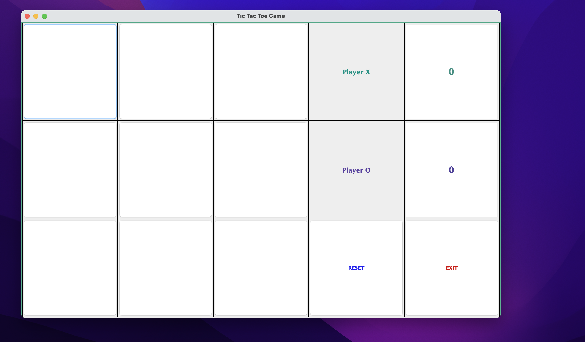
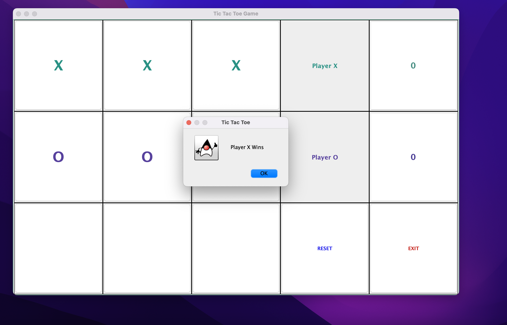
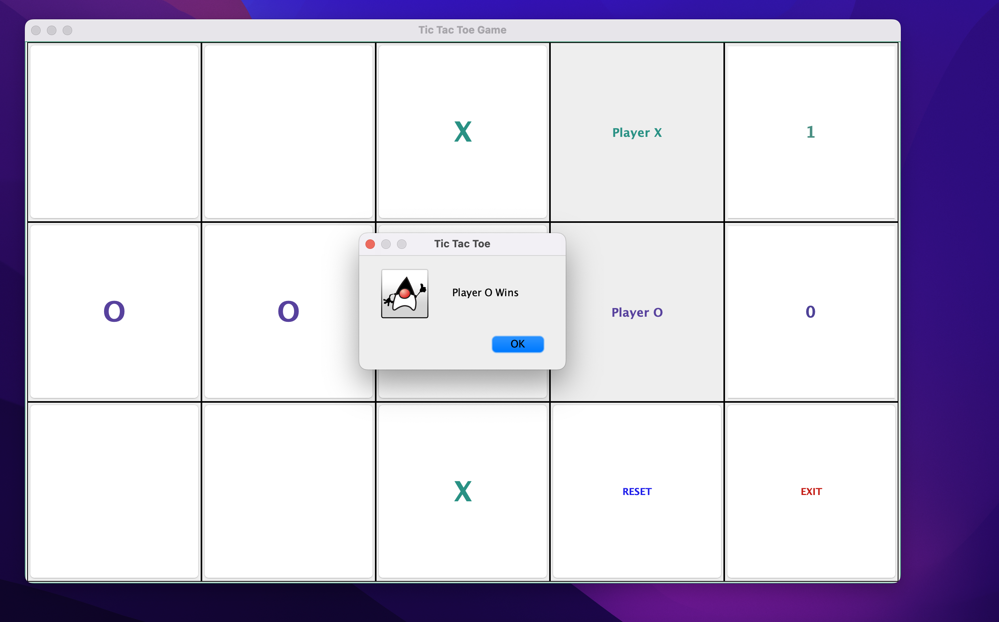
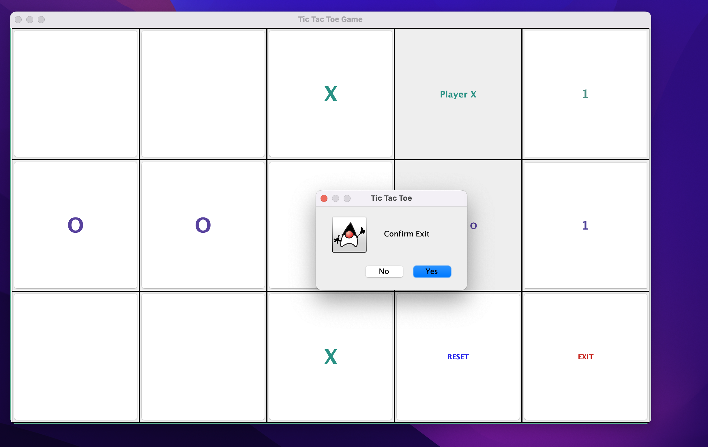

# TicTacToe Game with a GUI
This project was aimed at exploring some functionalities in the Java language. I decided to work on this project so I can practice the use of the following in Java:

- Variables
- Expressions
- Conditionals
- Loops
- Functions
- Classes
- Data structure from Java Collection Framework (such as ArrayList, TreeSet, or HashMap)

Many of you are aware of a classic game called TicTacToe. Because I love the logic behid this game, I decided to do some research into some better ways to create the same game but also providing a Graphical User Interface to make the game experience richer.

## YouTube Demo Video
Here is a [link](https://youtu.be/0-fliSzYR9U) to view a [video demonstration](https://youtu.be/0-fliSzYR9U) of this project and some important part of the code that makes the game come alive.

## Development Environment

- [Eclipse](https://www.eclipse.org/downloads/)

## Prgramming Language

- [JAVA](https://docs.oracle.com/en/java/javase/index.html)

## List of websites and YouTube Videos
I used a number of websites and youtube videos while learning java and working on this project. I particularly like a youtube video that gave an indept guide on how to use JFrames in Eclipse. Here is the [link](https://www.youtube.com/watch?v=n8RWUoBcn3E). 

Other useful links includes:

- [Link](https://github.com/github/gitignore/blob/main/Global/Eclipse.gitignore) to understand how to add .gitignore file to Eclipse projects. Here is [another link](https://stackoverflow.com/questions/18726217/gitignore-file-for-java-eclipse-project)

- [Link](https://stackoverflow.com/questions/98610/how-can-i-get-eclipse-to-show-files) to learn how to get .gitignore file to show up in Eclipse.
## Picture Time
A cool thing about using JFrames in Eclipse is that the size of this TicTacToe game is adjusttable to whatever size you wish it to be on your computer screen.

Empty Board

Player X wins

Player O wins

Exit prompt
